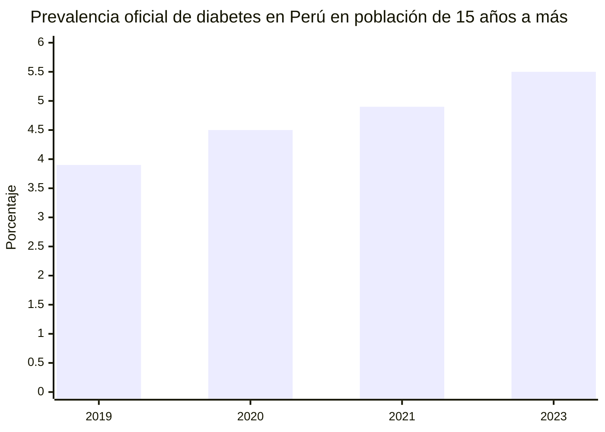
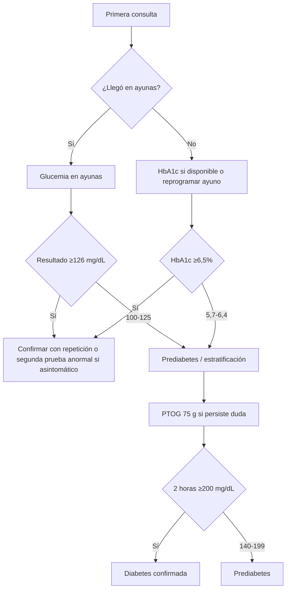

# Diabetes en Perú

## Resumen ejecutivo

La diabetes en Perú muestra una trayectoria ascendente en los datos oficiales recientes. En la población de 15 años a más, la prevalencia autorreportada pasó de **3,9% en 2019** a **4,5% en 2020**, **4,9% en 2021** y **5,5% en 2023**; esto equivale a un aumento de **1,6 puntos porcentuales** en cuatro años y, en términos relativos, a un incremento de alrededor de **41%** frente a 2019. El último dato nacional explícito y fácilmente verificable en texto abierto es el de **ENDES 2023**, que el propio MINSA resume como **1,3 millones de peruanos mayores de 15 años viviendo con diabetes**. citeturn37search13turn36search1turn36search3turn35search2

La carga sanitaria también es alta en términos clínicos y operativos. En noviembre de 2024, el MINSA indicó que la diabetes ya es la **séptima causa de muerte** en el país. En la vigilancia epidemiológica, el CDC Perú reportó **54.986 casos registrados entre enero de 2023 y junio de 2024** en 35 DIRESA/GERESA/DIRIS, y para 2025 la red de notificación se había ampliado a **1.600 establecimientos**; aun así, el propio CDC advirtió **subregistro**. Entre los casos notificados, predominan de forma abrumadora los de **diabetes tipo 2**. citeturn35search2turn10search0turn35search10turn35search12

En el diagnóstico clínico peruano se usan las mismas tres pruebas centrales que el usuario solicitó: **glucemia en ayunas**, **hemoglobina glicosilada HbA1c** y **prueba de tolerancia oral a la glucosa con 75 g**. Las fuentes técnicas peruanas y hospitalarias revisadas mantienen los umbrales habituales: **diabetes** con glucemia en ayunas **≥126 mg/dL**, HbA1c **≥6,5%** o glucosa a las 2 horas de la PTOG **≥200 mg/dL**; y **prediabetes** con ayuno **100–125 mg/dL**, HbA1c **5,7–6,4%** o PTOG **140–199 mg/dL**. citeturn39search1turn12search3

No existe, en fuentes públicas nacionales recientes, un indicador estándar de “**pacientes por día por consulta de diabetes**” para todos los tipos de establecimientos. Lo que sí existe son datos operativos parciales y estándares de productividad. En hospitales MINSA, la programación oficial usa **turnos de 4 horas** de consulta externa, y varios documentos de gestión hospitalaria mantienen una productividad objetivo de **4 a 5 consultas por hora**. Con ese estándar, un consultorio que atiende diabetes o endocrinología en un solo turno suele moverse alrededor de **16 a 20 pacientes/día por consultorio**, y en dobles turnos urbanos puede llegar a **32 a 40**. En establecimientos donde diabetes se atiende dentro de medicina general o crónicos del primer nivel, el dato exacto reciente **no está especificado** públicamente. citeturn41search11turn19search2turn18search11turn23search2

En los tiempos de laboratorio, el panorama es similar: los **tiempos internos exactos de evaluación de muestra** rara vez se publican. Lo que sí se publica, con mayor frecuencia, es el **tiempo de entrega al paciente**. En laboratorios privados peruanos, la glucosa basal/postprandial y la HbA1c suelen ofrecerse con entrega en **menos de 24 horas o 1 día hábil**; la PTOG de 2 horas añade, por diseño, una permanencia mínima de **2 horas** para la toma seriada, con entrega usual en **menos de 24 horas**. En un gran hospital público limeño, los “exámenes generales” se reportan en **1 día hábil**. Cuando el paciente además necesita una consulta posterior para interpretación y confirmación, el tiempo clínico total puede ampliarse a varios días. citeturn13search3turn16search0turn16search14turn15search2turn16search2

Las mayores demoras y desigualdades no provienen solo del laboratorio. Se relacionan con una prevalencia más alta en la **Costa** que en **Sierra** y **Selva**, concentración de casos en hospitales, una red de vigilancia aún en expansión, subregistro, diferencias de capacidad diagnóstica entre establecimientos y una integración todavía incompleta del diagnóstico y control de diabetes en atención primaria. En ese contexto, las intervenciones con mejor retorno probable son: **confirmación diagnóstica en circuito corto**, expansión de **HbA1c** y algoritmos de “**reflex testing**”, agendas específicas para crónicos en primer nivel, entrega digital de resultados y escalamiento del modelo **HEARTS-D** en atención primaria. citeturn42search12turn34search10turn10search0turn25search2turn25search16

## Magnitud y carga reciente

La serie oficial más consistente y reciente disponible en texto abierto muestra un ascenso sostenido de la diabetes diagnosticada en adultos peruanos. INEI informó **3,9%** en 2019, **4,5%** en 2020 y **4,9%** en 2021. Luego, el MINSA resumió la **ENDES 2023** con una prevalencia estimada de **5,5%** y alrededor de **1,3 millones** de personas de 15 años a más con diabetes. Aunque la publicación nacional ENDES 2024 ya existe, en las fuentes web abiertas revisadas no encontré una cifra nacional única de prevalencia de diabetes tan explícita como la de 2023; por eso, para la comparación estricta uso **2023 como el último punto nacional verificable de manera directa**. citeturn37search13turn36search1turn36search3turn35search2turn34search5

En términos de carga sanitaria, la diabetes no solo ha aumentado en prevalencia; también pesa en mortalidad y uso del sistema. El MINSA indicó en 2024 que la diabetes es la **séptima causa de muerte** en el país. Un estudio peruano sobre mortalidad asociada a DM2 encontró que las tasas variaron durante el quinquenio analizado, con picos en **2020 y 2021**, y que **Madre de Dios** presentó la mortalidad más alta dentro de las regiones evaluadas; además, la edad promedio de muerte fue de **75 años**. citeturn35search2turn32search4

La vigilancia epidemiológica confirma una gran presión de casos, aunque todavía incompleta. El CDC Perú reportó **54.986 casos de diabetes** entre enero de 2023 y junio de 2024 y llamó la atención sobre el **escaso registro** en varias jurisdicciones, lo que implica que los registros de vigilancia **no equivalen** al total atendido por el sistema. En 2025, la red de notificación ya alcanzaba **1.600 establecimientos** —**1.440 del primer nivel** y **160 hospitales**— e incluía MINSA, FFAA, PNP, clínicas privadas y SISOL. citeturn10search0turn35search10

La composición por tipo también importa para planificar capacidad. Según INS/MINSA, **96,0%** de los casos notificados corresponden a **diabetes tipo 2**, **1,5%** a **tipo 1** y **2,5%** a **diabetes gestacional**. En niños y adolescentes, el INSN informó en 2024 que ahora recibe **13 a 15 casos nuevos al año** de diabetes tipo 2 en menores, cuando antes de la pandemia veía **1 o 2** por año, lo que sugiere una transición epidemiológica también en edades pediátricas. citeturn35search12turn44search13

La distribución territorial sigue siendo muy desigual. En 2022, el mayor porcentaje de personas con diabetes se observó en la **Costa (6,0%)**, seguido de la **Selva (4,5%)** y la **Sierra (3,0%)**. Para 2021, el INEI ya reportaba que la **Costa** concentraba la mayor prevalencia, con **5,8%**. En 2021, además, el MINSA resaltó que **Lima, Piura y Lambayeque** concentraban el mayor número de diabéticos, coherente con un patrón de mayor carga urbana y costera. citeturn42search12turn43search4turn44search4

La edad y el acceso a tratamiento muestran otra cara del problema. En la población de **60 años a más**, la diabetes afectó a **14,0%** tanto en **2023 como en 2024**, según el boletín de población adulta mayor de INEI. En la población general diagnosticada, la proporción que recibió tratamiento fue **77,7%** en 2019, **69,7%** en 2020 y **64,4%** en 2021; más recientemente, el Programa Presupuestal 0018 reportó que la cobertura de diagnóstico y tratamiento en personas de 15 años a más con diabetes pasó de **70,3% en 2023** a **72,6% en 2024**, una recuperación parcial, pero todavía insuficiente para una enfermedad crónica de alta prevalencia. citeturn36search2turn44search3turn44search0turn44search6turn37search16

### Tabla comparativa de prevalencia y carga

| Indicador | Valor más reciente verificable | Observación analítica |
|---|---:|---|
| Prevalencia en personas de 15+ años, 2019 | 3,9% | Punto de partida previo al salto reciente. citeturn37search13 |
| Prevalencia en personas de 15+ años, 2020 | 4,5% | Aumento de 0,6 pp vs. 2019. citeturn36search1 |
| Prevalencia en personas de 15+ años, 2021 | 4,9% | Aumento acumulado de 1,0 pp vs. 2019. citeturn36search3 |
| Prevalencia en personas de 15+ años, 2023 | 5,5% | Último dato nacional explícito y verificable en texto abierto. citeturn35search2 |
| Personas 15+ con diabetes, 2023 | 1,3 millones | Estimación oficial resumida por MINSA a partir de ENDES 2023. citeturn35search2 |
| Posición en causas de muerte, 2024 | 7.ª causa | Alta carga clínica y sanitaria. citeturn35search2 |
| Casos registrados en vigilancia, ene 2023–jun 2024 | 54.986 | No equivale al total atendido; CDC señala subregistro. citeturn10search0 |
| Red de vigilancia, 2025 | 1.600 IPRESS | 1.440 de primer nivel y 160 hospitales. citeturn35search10 |
| Distribución por tipo, casos notificados recientes | 96,0% DM2; 1,5% DM1; 2,5% gestacional | Predominio casi absoluto de DM2. citeturn35search12 |
| Adultos mayores con diabetes, 2024 | 14,0% | Carga muy alta en 60+. citeturn36search2 |

La lectura de conjunto es clara: Perú no enfrenta solo un problema de control terapéutico, sino también de **crecimiento de la base de pacientes**, con fuerte concentración en población adulta mayor, zonas costeras y entornos urbanos. citeturn42search12turn36search2turn44search4

## Diagnóstico en la práctica peruana

En la práctica clínica peruana, las tres pruebas nucleares para diagnóstico y clasificación metabólica siguen siendo las que usted indicó: **glucemia en ayunas**, **HbA1c** y **prueba de tolerancia oral a la glucosa de 75 g**. Un documento técnico peruano de referencia para prevención y control nutricional de la DM2 y una guía hospitalaria peruana describen los mismos umbrales diagnósticos: **ayuno ≥126 mg/dL**, **HbA1c ≥6,5%** y **glucosa a las 2 horas ≥200 mg/dL** para diabetes; y rangos intermedios para prediabetes. citeturn39search1turn12search3

Hay, sin embargo, una diferencia importante entre el **método ideal** y el **método realmente disponible**. Una evaluación rápida del INS de 2020 muestra que, en normas técnicas peruanas específicas para tamizaje de diabetes en pacientes con tuberculosis, el MINSA recomendaba **glucosa en ayunas** como método de diagnóstico, mientras que la guía OMS/La Unión aceptaba **glucosa en ayunas o HbA1c** cuando el establecimiento tuviera capacidad para implementarla. Esa diferencia sigue siendo útil para entender la realidad peruana actual: en establecimientos con menor capacidad analítica, la glucemia en ayunas continúa siendo la prueba más accesible; donde hay laboratorio más robusto, la HbA1c acorta fricciones logísticas porque **no requiere ayuno**. citeturn38search1

### Tabla comparativa de pruebas diagnósticas usadas en Perú

| Prueba | Preparación | Rango de prediabetes | Umbral de diabetes | Ventaja operativa principal | Limitación operativa principal |
|---|---|---|---|---|---|
| Glucemia en ayunas | Ayuno de 8–12 horas | 100–125 mg/dL | ≥126 mg/dL | Amplia disponibilidad y bajo costo relativo. citeturn39search1turn12search3 | Obliga a segunda visita si el paciente no llegó en ayunas. citeturn39search1turn38search1 |
| HbA1c | No requiere ayuno | 5,7–6,4% | ≥6,5% | Puede tomarse en cualquier momento; útil para acortar proceso. citeturn39search1turn24search9 | Menor disponibilidad en entornos con capacidad analítica limitada. citeturn38search1 |
| PTOG 75 g a 2 horas | Ayuno + permanencia de 2 horas | 140–199 mg/dL a las 2 h | ≥200 mg/dL a las 2 h | Útil cuando hay duda diagnóstica o discordancia. citeturn39search1 | Consume tiempo del paciente y del servicio; es la prueba más lenta. citeturn39search1turn16search14 |

### Pasos clínicos típicos desde la primera consulta

En un circuito clínico razonable en Perú, el proceso suele empezar con una **primera consulta** en medicina general, medicina interna, endocrinología, obstetricia o control de crónicos. Allí se revisan síntomas, factores de riesgo y antecedentes, y se decide la prueba inicial. Si el paciente **ya llegó en ayunas**, puede tomarse la glucemia el mismo día; si no llegó en ayunas, el establecimiento puede optar por **HbA1c** si dispone de ella o reprogramar una toma en ayunas. Si el primer resultado cae en rango de diabetes y el paciente es **asintomático**, en la práctica suele requerirse **confirmación** con repetición o con una segunda prueba anormal; si hay síntomas claros y acceso inmediato a laboratorio, el diagnóstico puede cerrarse más rápido, pero no encontré una fuente peruana reciente que publique un “tiempo estándar” oficial para ese cierre clínico. citeturn39search1turn38search1turn24search9

### Tiempo típico para predecir o diagnosticar desde la primera consulta

Aquí es importante separar lo **publicado** de lo **inferido**.

**Lo publicado** permite afirmar que:
- la **HbA1c** puede tomarse sin ayuno; citeturn24search9turn16search2
- la **PTOG** exige una permanencia de **2 horas** para completar el procedimiento; citeturn16search14
- en laboratorios privados peruanos, glucosa, HbA1c y PTOG suelen devolverse en **menos de 24 horas o 1 día hábil**; citeturn13search3turn16search0turn16search14
- en un hospital público grande, los exámenes generales se entregan en **1 día hábil**. citeturn15search2

**Lo no especificado** en fuentes públicas peruanas recientes es el “promedio nacional” desde la primera consulta hasta el diagnóstico confirmado. Por ello, el rango más prudente es este:

| Escenario clínico | Tiempo probable desde primera consulta hasta diagnóstico/definición | Base |
|---|---|---|
| Paciente llega en ayunas y laboratorio in situ | **mismo día a 24 horas** | Prueba + liberación rápida del resultado. citeturn13search3turn15search2 |
| Paciente no llega en ayunas, pero hay HbA1c disponible | **mismo día a 48 horas** | Toma inmediata sin ayuno; entrega usual el mismo día o 24–48 h. citeturn16search2turn16search0 |
| Paciente asintomático que requiere confirmación con repetición/segunda prueba | **1 a 7 días** en circuito urbano ágil; **2 a 14 días** en circuito público con reprogramación | **Rango inferido**, porque el tiempo oficial exacto no está publicado. Se apoya en necesidad de una segunda interacción clínica/laboratorial y en tiempos de entrega de pruebas. citeturn15search2turn13search3turn16search0 |
| PTOG por duda diagnóstica | **mínimo 2 horas** para la prueba + **mismo día a 1 día** para liberación; si requiere nueva cita médica, más tiempo | Procedimiento intrínsecamente más largo. citeturn16search14turn15search2 |

En suma, el tiempo de diagnóstico en Perú no depende tanto del criterio clínico —que está bien establecido— sino de tres cuellos de botella: si el paciente llegó o no en ayunas, si el establecimiento dispone de **HbA1c**, y si el caso necesita o no **confirmación en una segunda interacción**. citeturn38search1turn24search9

## Demanda asistencial y tiempos operativos

No encontré una fuente oficial nacional reciente que publique un “**promedio de pacientes por día en consulta por diabetes**” desagregado por centro de salud, hospital y región. Eso debe dejarse explícito. Lo que sí existe es una combinación de: **volúmenes hospitalarios agregados**, **horarios de consulta externa** y **estándares de productividad por hora médica**. A partir de ello puede construirse un rango operativo razonable, pero debe entenderse como una **estimación operativa**, no como un indicador estadístico nacional oficial. citeturn45view1turn19search2turn41search11

En hospitales del MINSA, la directiva administrativa vigente para consulta externa usa **turnos de 4 horas**. Además, distintos documentos de desempeño hospitalario fijan como meta una **productividad de 4 a 5 consultas por hora**. Aplicado a un consultorio que atiende endocrinología o diabetes, eso equivale a **16 a 20 atenciones por día por turno**. Si el servicio opera en **doble turno**, el volumen por consultorio puede subir a **32 a 40 atenciones/día**. Esto se alinea con horarios publicados en hospitales urbanos: por ejemplo, el Hospital San José del Callao reporta atención de consulta externa en turnos de **8 a 14 h** y **14 a 20 h**, y el Hospital Loayza publica consulta externa de **7 a 18 h** de lunes a viernes. citeturn41search11turn19search2turn23search2turn41search9

Los grandes hospitales de Lima ilustran la escala absoluta. El Hospital Nacional Cayetano Heredia reportó **348.562 atenciones de consulta médica** en 2024, cifra superior a 2023 y muy por encima de 2021 y 2022, reflejando recuperación pospandemia y presión asistencial sostenida. El Hospital Nacional Dos de Mayo registró **195.931 consultas médicas entre enero y octubre de 2024**. Estas cifras no son específicas de diabetes, pero marcan el contexto de alta congestión donde se inserta la atención diabetológica. citeturn45view1turn22search9

En establecimientos de menor complejidad, la fotografía cambia. La vigilancia epidemiológica del MINSA reportó para 2021 que **78%** de los casos de diabetes notificados provenían de **hospitales**, **14%** de **centros de salud** y **7%** de **puestos de salud**. Eso sugiere que el grueso de la carga capturada por vigilancia seguía concentrándose en hospitales, aunque para 2025 la red notificante ya incluía una fuerte expansión del primer nivel. En otras palabras: el primer nivel está creciendo como puerta de entrada y seguimiento, pero la demanda visible y registrada históricamente sigue muy hospitalizada. citeturn34search10turn35search10

### Rangos operativos de pacientes por día en consulta de diabetes

| Tipo de establecimiento | Rango operativo plausible | Qué sí puede afirmarse | Qué no está especificado |
|---|---:|---|---|
| Hospital II-2 / III, un turno de 4 h | **16–20 pacientes/día por consultorio** | Deriva de 4 h por turno y 4–5 consultas/hora. citeturn41search11turn19search2 | No existe promedio nacional reciente específico para “consulta de diabetes”. |
| Hospital urbano con doble turno | **32–40 pacientes/día por consultorio** | Compatible con horarios publicados de doble jornada. citeturn23search2turn41search9 | Varía según número de médicos, ausentismo y mezcla de casos. |
| Centro de salud / primer nivel | **No especificado en fuente pública reciente** | La red de vigilancia 2025 incluye 1.440 establecimientos de primer nivel. citeturn35search10 | No encontré un promedio reciente de pacientes/día exclusivamente para diabetes. |
| Puesto de salud | **No especificado** | Solo 7% de casos notificados en 2021 provinieron de puestos. citeturn34search10 | El dato reciente de productividad por diabetes no está publicado. |

### Tiempos de laboratorio y entrega de resultados

En los laboratorios peruanos revisados, el dato más fácil de verificar es el **tiempo de entrega del informe**; el **tiempo interno desde toma de muestra hasta análisis** casi nunca se publica. Por ello conviene separar ambos.

| Prueba | Tiempo de toma/procedimiento | Tiempo de evaluación interna de la muestra | Tiempo de resultado al paciente en laboratorio privado | Tiempo de resultado al paciente en hospital público |
|---|---|---|---|---|
| Glucemia en ayunas | Minutos | **No especificado** públicamente; en operación suele ser corto una vez ingresada la muestra | **1 día hábil** en ejemplos peruanos revisados. citeturn13search3 | **1 día hábil** para exámenes generales en Loayza. citeturn15search2 |
| HbA1c | Minutos | **No especificado**; un laboratorio privado describe plataforma automatizada “rápida” | **Menos de 24 h** o **1 día hábil**; en otros casos, **24–48 h**. citeturn16search0turn16search3turn16search2turn13search5 | **No especificado por prueba** en fuente pública reciente; si se procesa como bioquímica general y está disponible onsite, el rango práctico suele ser **1–2 días**, pero esto es **inferencia**, no cifra oficial. citeturn15search2turn16search2 |
| PTOG 75 g | **2 horas** como mínimo por protocolo de toma | **No especificado** | **Menos de 24 h** en ejemplo peruano revisado. citeturn16search14 | **No especificado por prueba**; si el hospital la reconoce como examen general, podría ser **1 día hábil**, pero la fuente pública reciente no lo detalla por PTOG. citeturn15search2 |

La conclusión operativa es sencilla. En Lima y otras ciudades con laboratorio privado estructurado, el cuello de botella principal ya no suele ser el laboratorio, sino la **confirmación clínica**. En el sector público, el laboratorio puede resolver un examen general en un día, pero el proceso completo se alarga si el paciente necesita volver con otra cita para interpretación o repetición confirmatoria. citeturn15search2turn16search2

## Barreras y variaciones regionales

La primera barrera es epidemiológica y geográfica: la carga no se distribuye de forma uniforme. La **Costa** concentra la mayor prevalencia conocida en la serie reciente y también varios de los departamentos con mayor número absoluto de personas con diabetes. Esto implica más demanda diagnóstica y más congestión asistencial en corredores urbanos costeros como Lima, Piura y Lambayeque. citeturn42search12turn44search4

La segunda barrera es etaria. La diabetes en adultos mayores es muy frecuente: **14,0%** en 2024. Eso aumenta la probabilidad de comorbilidad, polifarmacia y necesidad de controles repetidos, lo que consume más tiempo clínico y más recursos de laboratorio por paciente que en cohortes más jóvenes. citeturn36search2

La tercera barrera es organizacional. En 2021, **78%** de los casos notificados a vigilancia venían de hospitales, no del primer nivel. Aunque entre 2022 y 2025 se amplió la red notificante hacia establecimientos de menor complejidad, el patrón sigue sugiriendo una atención demasiado concentrada en hospitales para una enfermedad que, idealmente, debería resolverse y controlarse en gran parte desde atención primaria. La OPS ha impulsado precisamente ese cambio con **HEARTS-D**, una línea técnica para integrar el diagnóstico y manejo de DM2 en atención primaria peruana. citeturn34search10turn35search10turn25search2turn25search16

La cuarta barrera es de acceso diagnóstico efectivo. Los datos de tratamiento sugieren deterioro y recuperación parcial: **77,7%** de las personas diagnosticadas recibió tratamiento en 2019, **69,7%** en 2020 y **64,4%** en 2021; recién en 2024 el programa presupuestal reporta un nivel de cobertura de diagnóstico y tratamiento de **72,6%**. Eso todavía deja a una proporción importante fuera del circuito óptimo de confirmación, control y seguimiento. citeturn44search3turn44search0turn44search6turn37search16

La quinta barrera es la capacidad analítica desigual. En Perú, la **glucemia en ayunas** sigue siendo la prueba más fácil de desplegar de manera universal, mientras la **HbA1c** depende más de infraestructura y capacidad instalada. Eso explica por qué el proceso diagnóstico puede ser ágil en una clínica urbana o más lento en un establecimiento que obliga al paciente a regresar en ayunas o a derivarse. citeturn38search1turn39search1

La sexta barrera es informacional. El CDC Perú reconoció “**escaso registro**” en la vigilancia de diabetes. Eso no significa que el sistema no atienda a los pacientes; significa que el sistema todavía no mide con suficiente consistencia cuántos pasan por cada tramo del proceso diagnóstico. Esta ausencia de trazabilidad operativa explica por qué Perú sí puede informar prevalencia y casos notificados, pero no puede publicar con la misma solidez tiempos promedio nacionales desde primera consulta hasta diagnóstico confirmado. citeturn10search0turn35search10

## Recomendaciones para reducir tiempos de diagnóstico

La medida con mayor impacto inmediato sería **convertir la primera consulta en una consulta resolutiva** para buena parte de los casos sospechosos. En establecimientos con capacidad de HbA1c, eso implica hacer **HbA1c el mismo día** cuando el paciente no llegó en ayunas y reservar la glucemia en ayunas como alternativa donde no exista ese recurso. Esta recomendación se desprende del hecho de que la HbA1c no requiere ayuno y de que su disponibilidad reduce una visita adicional. citeturn24search9turn38search1

La segunda recomendación es instaurar protocolos de **confirmación en circuito corto**. Si una glucemia en ayunas sale en rango diabético, el sistema debería disparar automáticamente una segunda prueba confirmatoria o una HbA1c reflejo, sin obligar a un trayecto burocrático separado. Esta es una inferencia organizacional, pero está directamente respaldada por los umbrales diagnósticos claros y por el hecho de que gran parte de la demora no es analítica, sino de reprogramación. citeturn39search1turn15search2turn16search2

La tercera es fortalecer la **agenda del primer nivel para crónicos** y alinear la expansión de la red ya notificante con el modelo **HEARTS-D**. Si 1.440 establecimientos de primer nivel ya forman parte de la red de vigilancia en 2025, el siguiente paso lógico es que una proporción mayor del diagnóstico y seguimiento de DM2 ocurra allí, con menos derivación innecesaria a hospitales. citeturn35search10turn25search2turn25search16

La cuarta es publicar indicadores operativos que hoy no están disponibles. Perú debería medir, por IPRESS y por red, al menos cuatro tiempos: **desde primera sospecha hasta toma de muestra**, **desde toma hasta validación analítica**, **desde validación hasta entrega al paciente**, y **desde resultado anormal hasta confirmación médica**. El hecho de que hoy muchos de estos tiempos sean “no especificados” es, en sí mismo, una brecha de gestión. citeturn10search0turn15search2

La quinta es digitalizar la entrega. En laboratorios privados, la consulta de resultados en línea ya es una práctica establecida; en hospitales públicos, el resultado muchas veces existe en un día, pero la circulación del documento y la interpretación clínica posterior agregan demora. La entrega digital interoperable reduciría tiempos muertos, especialmente en zonas urbanas con alta demanda. citeturn13search11turn15search2

La sexta es priorizar grupos de alto rendimiento diagnóstico: **adultos mayores**, pacientes con obesidad, diabetes gestacional previa y población costera urbana, porque allí la prevalencia y el rendimiento de tamizaje parecen mayores. Focalizar el diagnóstico oportuno en esos grupos puede reducir tiempos y aumentar detección verdadera sin multiplicar pruebas de bajo rendimiento. citeturn36search2turn42search12turn39search1

## Fuentes clave y vacíos de información

Las fuentes más robustas para este informe fueron: **INEI-ENDES** para prevalencia y tratamiento; **MINSA/CDC Perú** para vigilancia, red notificante y carga sanitaria; **OPS/OMS** para la estrategia de integración en atención primaria; **hospitales públicos** para horarios y volúmenes asistenciales; y **laboratorios privados peruanos** para tiempos de entrega operativos de pruebas. Entre las fuentes más útiles estuvieron: la nota del MINSA sobre diabetes como séptima causa de muerte, la sala situacional del CDC, los reportes programáticos del **PP 0018**, el boletín estadístico 2024 del Hospital Nacional Cayetano Heredia y las fichas de exámenes de Multilab y del Hospital Loayza. citeturn35search2turn35search10turn37search16turn45view1turn16search0turn15search2

Los principales vacíos fueron tres. El primero es que **no encontré un indicador nacional reciente y público** de pacientes por día específicamente en “consulta de diabetes” para centros de salud y hospitales. El segundo es que **no están publicados de forma sistemática** los tiempos internos de laboratorio desde toma de muestra hasta análisis validado por cada prueba. El tercero es que, aunque la **ENDES 2024** ya fue publicada, en las fuentes web abiertas revisadas no hallé una cifra nacional única de prevalencia de diabetes tan claramente expuesta como la de 2023. Por ello, los rangos operativos sobre tiempos y volumen diario deben leerse como **estimaciones prudentes basadas en fuentes parciales**, no como promedios oficiales nacionales. citeturn34search5turn15search2turn19search2turn41search11

### Referencias seleccionadas con fecha de publicación

| Fuente | Institución | Fecha de publicación | Uso principal |
|---|---|---|---|
| “La diabetes se constituye como séptima causa de muerte en nuestro país” | MINSA | 14 nov 2024 | Prevalencia 2023, 1,3 millones, séptima causa de muerte. citeturn35search2 |
| “Perú: Enfermedades No Transmisibles y Transmisibles, 2023” | INEI | 23 may 2024 | Contexto ENDES 2023 y disponibilidad del informe. citeturn35search15 |
| Nota de prensa INEI sobre comorbilidades 2020 | INEI | 2021 | Prevalencia 2020 y tratamiento. citeturn36search1turn44search0 |
| Nota de prensa INEI sobre ENDES 2021 | INEI | 13 may 2022 | Prevalencia 2021 y tratamiento. citeturn44search6 |
| Boletín “Situación de la población adulta mayor” | INEI | 2025 | Diabetes en 60+ años, 2024. citeturn36search2 |
| Reporte anual PP 0018 y reporte 2025-III | MINSA | 2023 y 29 dic 2025 | Diferencias regionales 2022; cobertura 2023–2024. citeturn42search12turn37search16 |
| “Actualización en vigilancia de diabetes” | CDC Perú | 2024 | 54.986 casos ene 2023–jun 2024 y subregistro. citeturn10search0 |
| Sala Situacional de Diabetes | CDC Perú | actualización 2025–2026 | Red de notificación y cobertura institucional. citeturn35search10 |
| “HEARTS en Perú: Hacia una mejor atención de la diabetes…” | OPS/OMS | 19 ago 2024 | Integración de diabetes a APS. citeturn25search2 |
| “Perú avanza en la integración de servicios…” | OPS/OMS | 4 nov 2024 | Continuidad de la estrategia ENT/diabetes en APS. citeturn25search16 |
| Boletín Estadístico 2024 HNCH | Hospital Nacional Cayetano Heredia | 2024 | Volumen hospitalario de consulta externa. citeturn45view1 |
| “Solicitar exámenes de laboratorio…” | Hospital Arzobispo Loayza | 3 abr 2025 | Tiempo de entrega de exámenes generales en hospital público. citeturn15search2 |
| Fichas de glucosa, HbA1c y PTOG | Multilab | 2024–2026 | Tiempos de entrega en laboratorio privado peruano. citeturn13search3turn16search0turn16search14 |
| “Hemoglobina glicosilada: ¿qué es y cómo se realiza?” | Multilab/MA | 10 oct 2024 | Misma jornada o 24–48 h para HbA1c. citeturn16search2 |

En síntesis, el cuadro peruano es el de una enfermedad en expansión, con criterios diagnósticos clínicamente claros, pero con una gestión operativa todavía desigual: **el diagnóstico puede ser rápido; el sistema aún no lo hace rápido de manera homogénea**. citeturn35search2turn10search0turn25search2